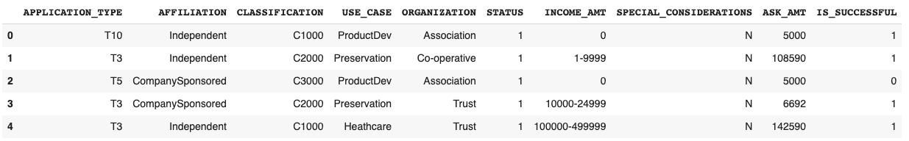
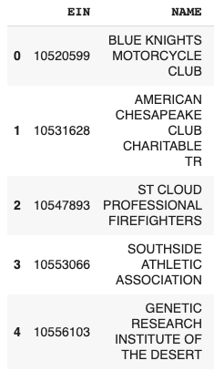
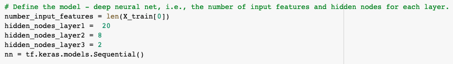

# Neural_Network_Charity_Analysis
Bootcamp Module 19 Neural analysis

# Overview
It seeks to help Alphabet Soup’s to define which can be the cases of success in the organizations that financially support and which have risk

# Results

- What variable(s) are considered the target(s) for your model?
The fields that are considered the target is APPLICATION_TYPE and CLASSIFICATION

- What variable(s) are considered to be the features for your model?

AFFILIATION
USE_CASE
ORGANIZATION
STATUS
INCOME_AMT
SPECIAL_CONSIDERATIONS
ASK_AMT
IS_SUCCESSFUL

- What variable(s) are neither targets nor features, and should be removed from the input data?

The fields EIN and NAME could be remove from the data

## Compiling, Training, and Evaluating the Model

- How many neurons, layers, and activation functions did you select for your neural network model, and why?

It was carried out with a variety of variables. Obtaining better results with:

- Were you able to achieve the target model performance?
No

- What steps did you take to try and increase model performance?
We try just with adding more neurons, but doesn't work.

# Summary

It is recommended to have more data to generate a more accurate model.